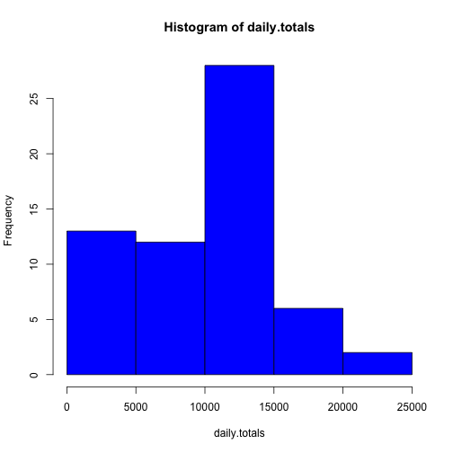
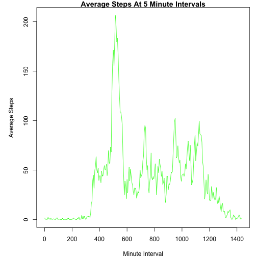
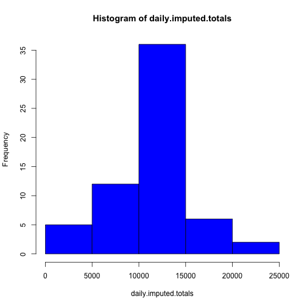
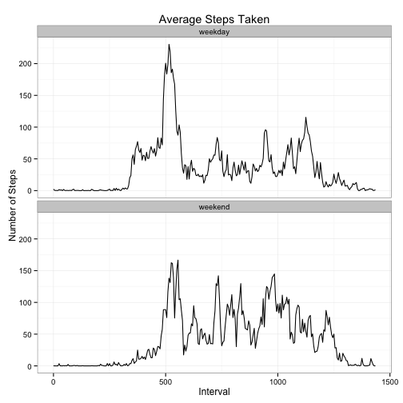

# Reproducable Research - Project 1


This assignment is an analysis of data collected from a personal activity monitor during the months of October and November, 2012 and include the number of steps taken in 5 minute intervals each day.

The data is read from a file called: activity.csv, and contains 3 columns:    

- **steps**     - count of steps in 5 minute intercals  
- **date**      - date the data was recorded  
- **interval**  - minute mark within the hour for the 5 minute intervals  

The following steps describe the details of the analysis

### Read the data from the file

The file data gives the intervals as the minute within the hour, which goes to 60 and then back to 0 again, adding 100 for the next hour.    
In order to get a continuous interval, the hundreds were converted back to their 60 minute increment and added back.  
The new field is called **minutes**.


```r
activity <- read.csv("activity.csv")
#add minutes field
activity <- cbind(activity,
                  ((activity$interval %/% 100) * 60) +
                    activity$interval  %% 100)
colnames(activity)[4] <- "minutes"
```
  
  
  
### What is mean total number of steps taken per day?

The first question is to find the total number of steps per day, and make a histogram showing the distribution of the daily step totals


```r
daily.totals <- with(activity,
     tapply(steps,date,sum, na.rm=TRUE))
hist(daily.totals, col="blue")
```

 

Then report on the mean and the median of the daily totals.  


```r
daily.mean = mean (daily.totals)
daily.median = median(daily.totals)
```

The mean daily step total is: 9354.2295 (daily.mean).  
The median daily step total is: 10395 (daily.median).    


### What is the average daily activity pattern?

This is a time series plot showing the average number of steps for each of the 5-minute intervals.  


```r
#Find the mean steps per minute
avg.interval.steps <- with(activity,
                            tapply(steps,minutes,mean,na.rm=TRUE))


par(mar=c(4,5,1,1))
plot(names(avg.interval.steps),
     avg.interval.steps,
     type="l", 
     main="Average Steps At 5 Minute Intervals",
     ylab="Average Steps",
     xlab="Minute Interval",
     col="green")
```

 

The next task was to find the interval that had the largest number of average steps


```r
med.interval <- names(avg.interval.steps[avg.interval.steps == max(avg.interval.steps)])
```
The interval with the largest average steps is 515 (med.interval) which translates to 8:35


### Finding missing values

There are some intervals that have no step counts reported.  
For any intervals that have missing values in the step count, substitute the average value for that interval.  

```r
#create a data frame with the intervals and average step counts
averages <- cbind(avg.interval.steps,
                  as.numeric(names(avg.interval.steps)))
colnames(averages)[2] = "minutes"

#merge this with the original data set
imputed <- merge(activity,
                 averages,
                 by.x = "minutes",
                 by.y = "minutes")

#find the NA values
missing <- is.na(imputed$steps)
print (paste("There are",
             sum(missing),
             "missing values in the dataset"))
```

```
## [1] "There are 2304 missing values in the dataset"
```

```r
#replace the missing values with the value in the average column
imputed[missing,"steps"] <- imputed[missing,"avg.interval.steps"]

#calculate the daily totals from the imputed data
daily.imputed.totals <- with(imputed,
                          tapply(steps,date,sum, na.rm=TRUE))
#plot the histogram
hist(daily.imputed.totals, col="blue")
```

 

```r
imputed.median = median(daily.imputed.totals) 
print(imputed.median)
```

```
## [1] 10766
```

```r
imputed.mean = mean (daily.imputed.totals)    
print(imputed.mean)
```

```
## [1] 10766
```

Imputing the absent values from the averages has raised the median and the mean daily totals.  
The median was 10395; it's now 10766.  
The mean was 9354.2295; it's now 10766.  
The imputed mean is now equivalent to the imputed median.  

Adding the missing data by using the average for the 5 minute interval increases both the mean and the median and skews the distribution towards that median value.  

### Weekend and Weekday Patterns


In order to compare the activity of a weekday with the activity on weekend, a new column called **is.weekday** is created to split the data between weekdays and weekends.   
With the new classifier, the average is calculated again for each 5 minute interval for weekdays/weekends.  
The results are shown in a time series plot.


```r
#create a function for determining weekend/weekday
assign_weekday <- function ( day ) {
  if (day == "Saturday" |
      day =="Sunday") 
  {
    "weekend"
  } else {
    "weekday"
  }
}

#Add weekday assignment to the imputed data frame
imputed <- 
  cbind(imputed,
      sapply(weekdays(as.Date(imputed$date,format='%Y-%m-%d')), 
             FUN=assign_weekday)
)
colnames(imputed)[6] <- "is.weekday"


#calculate the average steps based on the minute intervals per weekday
library(plyr)
groupColumns = c("minutes","is.weekday")
dataColumns = c("steps")
avg.steps = ddply(imputed, 
                  groupColumns, 
                  function(x) colMeans(x[dataColumns]))

#create a plot to compare weekday and weekend averages
library(ggplot2)
g <- ggplot(avg.steps, aes(x=minutes, y=steps)) + 
  geom_line() +
  facet_wrap( ~ is.weekday , nrow = 2, ncol = 1) +
  theme_bw() +
  labs(x = "Interval")  +
  labs(y = "Number of Steps")  +
  labs(title = "Average Steps Taken")
print(g)
```

 


